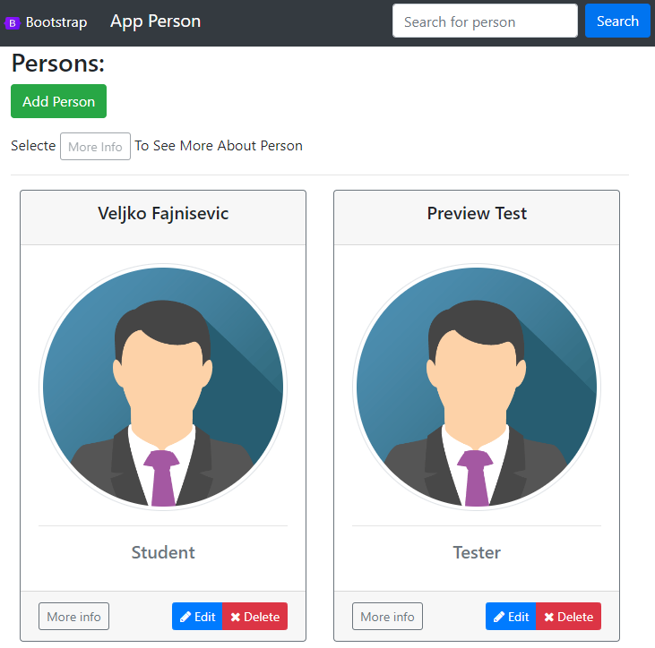

# Angular + Spring Boot + Firebase

Simple project for learning purposes.

## Project Structure

```
├── source
│   │
│   ├── backend     # Contains source code for backend (Java)
│   │
│   └── frontend    # Contains source code for frontend (TypeScript)
│
├── notes           # My notes
│
├── README.md
│
└── Endpoints.md    # Available endpoints
```

## Running App

Must run both __backend__ and __frontend__ together.

### Running Frontend

- `npm install`
- ~~`npm start`~~
- __`ng serve`__

(_localhost:4200_)

<details>
<summary>Image Preview</summary>
<p align="center">

</p>
</details>

### Running Backend

- Run local Tomcat Server in IntelliJ. 

(_localhost:8080_)

<details>
<summary>Image Preview</summary>
<p align="center">
    
</p>
</details>

<hr/>

Available endpoints inside <a href="./Endpoints.md">Endpoints.md</a> file.

Check folders for more in README.md