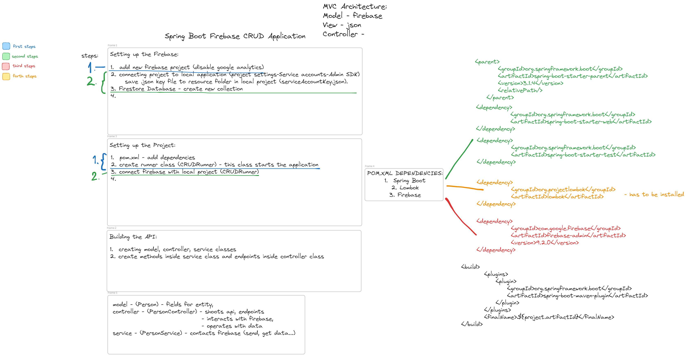
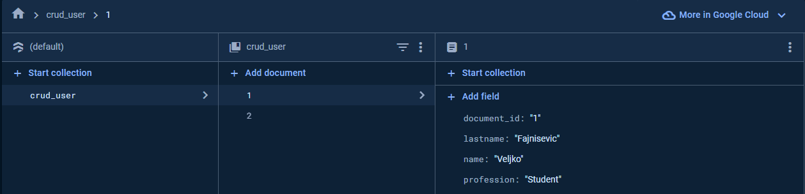
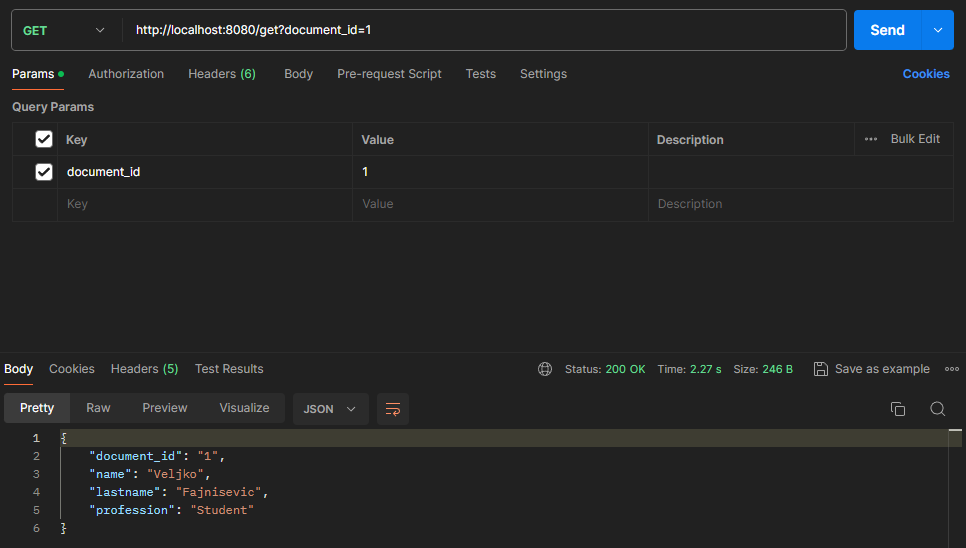
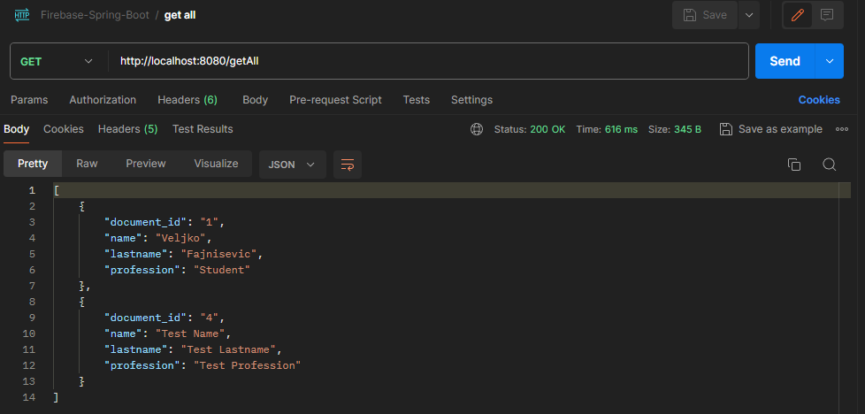
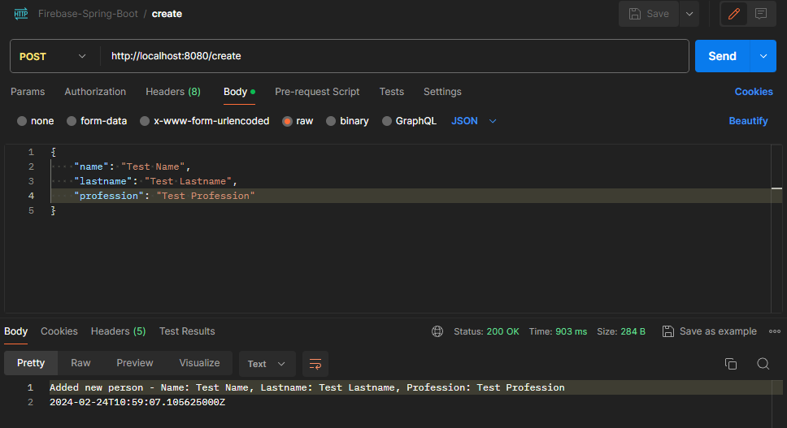
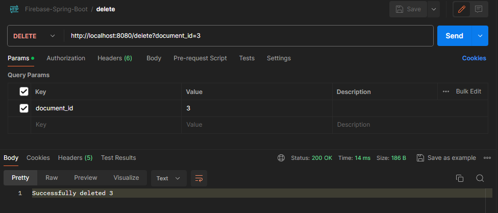
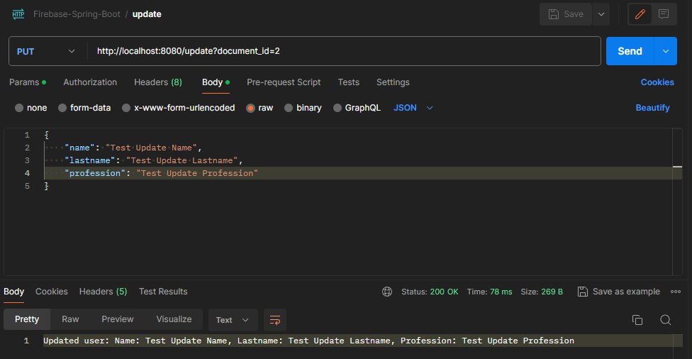

## Notes
MVC Architecture.

### General picture of project & Development

Image

### Testing

Unit testing. Only basic operations.

### Dependencies & Technologies

Dependencies:
- org.springframework.boot
- org.projectlombok
- com.google.firebase

Technologies:
- firebase
- spring boot v3.1.4

### Why Firebase?

No managing servers & database. Json format.
Flexible, Scalable NoSQL cloud database.
Contains realtime listeners that keeps data sync across apps.

FireStore

### Postman

Images From Postman

<b>GET SINGLE</b>

 
<b>GET ALL</b>

 
<b>CREATE</b>

 
<b>DELETE</b>

 
<b>UPDATE</b>

### TODO

TypeScript & Angular for FRONTEND!